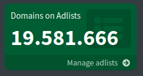

# pihole-blocklist
My personal anti-Microsoft and anti-Google (and more) pihole blocklist.

## HOWTO Pihole

- on the Pihole main page select `Adlists` on the left
- add `https://github.com/zocker-160/pihole-blocklist/releases/download/latest/blocklist.txt`
- update index using `pihole -g`
